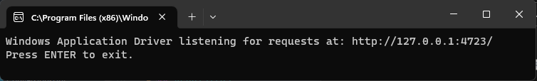

# Automatización FullStack (Servicios Rest - Web - Mobile - Desktop)

### Herramientas Implementadas

* Serenity BDD
* Serenity Rest
* Selenium
* Cucumber
* Appium
* WinAppDriver
* JavaFaker
* Lombok
* Selenium Grid
* Docker

### Patron De Diseño

* Screenplay

### Programming language

* Java

### Gestor de dependencias

* Gradle

## Automatización Servicios Rest

### RestFul-Booker

Se realizó la automatización del flujo de autenticación y reservas con escenarios Happy Paths y UnHappy Paths. Mediante
el consumo de diferentes servicios Rest de la aplicación [RestFul-Booker](https://restful-booker.herokuapp.com/apidoc/index.html) tales como

* POST / [Auth - CreateToken](https://restful-booker.herokuapp.com/auth)
* GET / [Booking - GetBookingIds](https://restful-booker.herokuapp.com/booking)
* GET / [Booking - GetBooking](https://restful-booker.herokuapp.com/booking/2)
* POST / [Booking - CreateBooking](https://restful-booker.herokuapp.com/booking)
* DELETE / [Booking - DeleteBooking](https://restful-booker.herokuapp.com/booking/7)
* GET / [Ping - HealthCheck](https://restful-booker.herokuapp.com/ping)

## Automatización Web

#### En Proceso

## Automatización Mobile

#### En Proceso

## Automatización Desktop

### Requisitos:

* Descargar [WinAppDriver](https://github.com/Microsoft/WinAppDriver/releases "WinAppDriver Releases")
  mediante el archivo **WindowsApplicationDriver.msi**, se recomienda dejar la ruta por defecto.
* Activar modo Desarrollador en Windows -> Configuración -> Buscar "Configuración del Desarrollador" ->**Activar el
  Check de Modo Programador**
* Descargar el instalador
  del [SDK Windows 10](https://developer.microsoft.com/es-es/windows/downloads/windows-10-sdk "Descargar SDK Windows 10")
  se recomienda dejar la ruta de instalación por defecto.

### Después de Instalar

* Vamos a la ruta donde se instaló el WinAppDriver y ejecutamos *WinAppDriver.exe* (ruta
  defecto: `C:\Program Files (x86)\Windows Application Driver`)

* Utilice **inspect.exe** para inspeccionar los elementos de la aplicación, la cual se encuentra en la
  ruta `C:\Program Files (x86)\Windows Kits\10\bin\10.0.18362.0\x64` (ruta de instalación del SDK de windows 10).

## Selenium Grid
#### En Proceso
## Autor 🤖

* Diego Fernando Merchan Jimenez
    